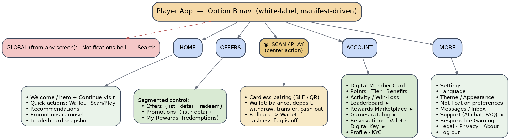

# Mobile Information Architecture & Navigation Plan — Option B (decided)

Screens aren't finalized, but the navigation frame is. Because the app is white-label, navigation
is **manifest-driven**: each tenant can enable, reorder, or relabel tabs/modules without a rebuild
(Section 6), so this is a strong **default** rather than a hard constraint.



---

## 1. Decision
**Bottom nav (Option B):** `Home · Offers · ⦿ Scan/Play (center) · Account · More`
- **Offers** absorbs Promotions via a segmented control: **Offers | Promotions | My Rewards**.
- **Scan/Play** is a prominent center action = cardless pairing (BLE/QR) + Wallet.
- **AI Chat is support-only**, living under **More ▸ Support** (not a global concierge button).
- Globals: Notifications bell + Search.

## 2. Why Option B
For a casino companion, the money-and-play action is the core utility, so making **Scan/Play** a
thumb-reach center action is the right prominence. Merging Promotions into a segmented **Offers**
tab avoids spending two of five slots on near-identical concepts while keeping both visible.

**Design-around (important):** the center action must never dead-end. Cardless is mocked in the MVP
and some tenants won't have cashless, so the center action is **feature-flag-aware**:
- cashless **on** → Scan/Play (pair + wallet);
- cashless **off** → falls back to **Wallet** (or a manifest-specified action).
Manifest-driven nav makes this a config change, not code.

## 3. Screen map
- **Home** — welcome/hero + continue-visit; quick actions (Wallet · Scan/Play); recommendations;
  promotions carousel; leaderboard snapshot.
- **Offers** — segmented: Offers (list/detail/redeem) · Promotions (list/detail) · My Rewards
  (redemption history).
- **Scan/Play (center)** — cardless pairing (BLE/QR) + Wallet (balance, deposit, withdraw,
  transfer, cash-out). Feature-flag fallback to Wallet.
- **Account** — Digital Member Card; Points/Tier/Benefits; Activity/Win-Loss; then entries to
  Leaderboard ▸, Rewards Marketplace ▸, Games catalog ▸, Reservations · Valet · Digital Key ▸,
  Profile/KYC.
- **More** — user/app hub (Section 5).

## 4. Where each "important" screen lives
| Screen | Primary entry | Secondary entry |
|---|---|---|
| Cardless / Cashless Play | Center **Scan/Play** | Games "Play now"; Home quick-action |
| Wallet | Center Scan/Play | Home quick-action; Account |
| Offers / Promotions | **Offers** tab (segmented) | Home promotions carousel |
| Leaderboard | Account ▸ | Home snapshot |
| Games catalog | Account ▸ | Home recommendations |
| Rewards Marketplace | Account ▸ | tier/benefits screen |
| Reservations · Valet · Digital Key | Account ▸ | More (optional) |
| Support (AI chat + FAQ) | **More ▸ Support** | contextual "Need help?" |
| Notifications / Messages | Global bell | More ▸ Messages |

## 5. The "More" screen (user hub)
Settings (profile, security/biometrics, privacy) · Language · Theme/Appearance · Notification
preferences (channels, quiet hours, location opt-in) · Messages/Inbox · **Support (AI chat, FAQ)** ·
Responsible Gaming (limits, self-exclusion, resources) · Legal · Privacy · About · Log out.

Split that prevents confusion: **Account** = "who I am + my value"; **More** = "how the app behaves
for me."

## 6. Config-driven navigation (white-label) — Option B manifest
```json
"navigation": {
  "tabs": [
    { "id": "home",    "label": "Home",    "icon": "home",         "enabled": true },
    { "id": "offers",  "label": "Offers",  "icon": "gift",         "enabled": true,
      "segments": ["offers","promotions","myRewards"] },
    { "id": "play",    "label": "Scan/Play","icon": "scan",        "enabled": true, "center": true,
      "requiresFlag": "cashless", "fallback": "wallet" },
    { "id": "account", "label": "Account", "icon": "user",         "enabled": true },
    { "id": "more",    "label": "More",    "icon": "menu",         "enabled": true }
  ],
  "globals": { "notifications": true, "search": true, "aiChat": false },
  "more": { "items": ["settings","language","theme","notifications","messages",
                       "support","responsibleGaming","legal","logout"] }
}
```
Tabs/modules also respect **feature flags** (hide Digital Key without a hotel; swap the center
action when cashless is off). Labels are localizable.

## 7. AI Chat — support-only scope
An in-app **support assistant** (not a concierge): answers help/FAQ questions from a per-tenant
knowledge base, and **escalates to a human / support ticket** when needed. **No transactional
actions** (no booking, redeeming, or moving money). Behind a `ChatPort` adapter (mock in MVP, real
provider by env), tenant-scoped, Responsible-Gaming/consent aware, conversations audited.
Lives under **More ▸ Support** + contextual "Need help?" entry points.

## 8. Folded into the build
- **P1.5** manifest now includes the `navigation` block.
- **P2.13** (backend) support AI chat via ChatPort.
- **P3.11** (admin) support-assistant configuration (FAQ/knowledge, guardrails, escalation).
- **P4.14** (mobile) support chat UI + **config-driven bottom navigation** (Option B tabs, center
  Scan/Play with feature-flag fallback, globals).
