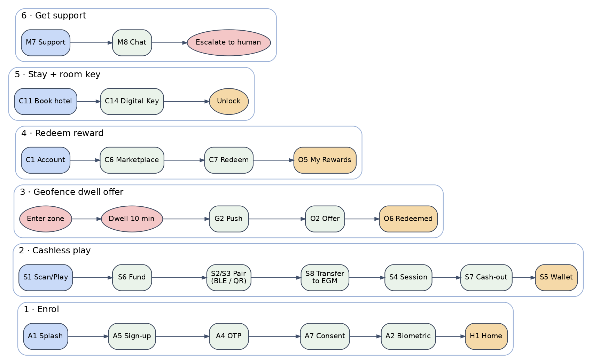

# Mobile Screen Inventory (Option B)

The firm **default** screen list for the player app: ~64 screens/states across onboarding, the five
Option B nav areas, and app/settings. Each screen maps to a build prompt in the playbook. Because
the app is white-label, screens appear/hide per **manifest feature flags**, so a given tenant sees a
subset.

**MVP status legend:** `[real]` shipped real in MVP · `[mock]` real UX, mocked adapter in MVP
(real vendor is Phase 2) · `[P2]` Phase 2. **Flag** = the feature flag that gates the screen.

---

## A. Onboarding & Auth
| ID | Screen | Purpose & key elements | MVP | Builds in |
|----|--------|------------------------|-----|-----------|
| A1 | Splash / brand load | Resolve tenant manifest + theme; version/force-update check | [real] | P4.1, P4.2 |
| A2 | Identify to Enter | Biometric unlock (Face/Touch ID); "Use passcode / Help" | [real] | P4.13 |
| A3 | Login | Email/phone + password | [real] | P4.3 |
| A4 | OTP verification | One-time code entry | [real] | P4.3 |
| A5 | Sign-up / enrolment | New member; link loyalty account (external_loyalty_id) | [real] | P4.3 (+P2.3) |
| A6 | Passcode set / entry | Fallback to biometrics | [real] | P4.13 |
| A7 | Permissions & consent | Notifications, location/background opt-in, T&Cs, RG acknowledgement | [real] | P4.9, P4.10 |
| A8 | Forgot password / recovery | Reset flow | [real] | P4.3 |
| A9 | KYC verification | Start + status (pass/refer/fail) | [mock] | P4.5 (KycPort) |

## B. Home tab
| ID | Screen | Purpose & key elements | MVP | Builds in |
|----|--------|------------------------|-----|-----------|
| H1 | Home dashboard | Hero + continue-visit; quick actions (Wallet · Scan/Play); recommendations; promotions carousel; leaderboard snapshot; tier/visit summary | [real] | P4.4 (+P4.2) |
| H2 | Recommendation detail | Deep-links into the relevant module | [real] | P4.4 |
| H3 | Continue / resume | Resume last session or play | [real] | P4.4 |

## C. Offers tab (segmented: Offers | Promotions | My Rewards)
| ID | Screen | Purpose & key elements | MVP | Builds in |
|----|--------|------------------------|-----|-----------|
| O1 | Offers list | Targeted offers (segment 1) | [real] | P4.4 |
| O2 | Offer detail + redeem | Terms, CTA, redemption | [real] | P4.4 (+P2.2) |
| O3 | Promotions list | Targeted promotions (segment 2) | [real] | P4.4 |
| O4 | Promotion detail | Details + CTA | [real] | P4.4 |
| O5 | My Rewards / history | Redemption history (segment 3) | [real] | P4.12 (+P2.12) |
| O6 | Redemption confirmation | Voucher / code / success state | [real] | P4.4 |

## D. Scan/Play (center action — Flag: cashless; falls back to Wallet if off)
| ID | Screen | Purpose & key elements | MVP | Builds in |
|----|--------|------------------------|-----|-----------|
| S1 | Scan/Play entry | Choose BLE-nearby or QR; fallback to Wallet if flag off | [mock] | P4.6, P4.14 |
| S2 | BLE pairing | Nearby machines list + connect | [mock] | P4.6 |
| S3 | QR scan | Camera pair at machine | [mock] | P4.6 |
| S4 | Machine session | Transfer-to-EGM, active credits, cash-out | [mock] | P4.6 |
| S5 | Wallet home | Balance; deposit/withdraw/transfer; recent transactions | [real] | P4.6 |
| S6 | Deposit / fund | Payment method + amount | [mock] | P4.6 (PaymentPort) |
| S7 | Withdraw / cash-out | Move funds out | [mock] | P4.6 |
| S8 | Transfer to EGM | Move funds to a paired machine | [mock] | P4.6 |
| S9 | Transaction history + detail | Ledger view | [real] | P4.6 |
| S10 | Payment methods | Add/remove tokenized cards | [mock] | P4.6 (PaymentPort) |

## E. Account tab
| ID | Screen | Purpose & key elements | MVP | Builds in |
|----|--------|------------------------|-----|-----------|
| C1 | Account home | Member card, points, tier progress, benefits, quick links | [real] | P4.5 |
| C2 | Digital member card | Full card, member ID / barcode | [real] | P4.5 |
| C3 | Tier & benefits | Progress to next tier + benefit list | [real] | P4.5, P4.12 |
| C4 | Activity / Win-Loss | Filterable statement | [real] | P4.5 |
| C5 | Leaderboard (full) | Ranking + own position | [real] | P4.11 |
| C6 | Rewards marketplace | Points catalog | [real] | P4.12 |
| C7 | Reward detail + redeem | Redeem with points (idempotent) | [real] | P4.12 |
| C8 | Games catalog | All/Slots/Tables, search, jackpot, favorites (Flag: games) | [real] | P4.11 |
| C9 | Game detail | Info; Play -> Scan/Play | [real] | P4.11 |
| C10 | Reservations list | Upcoming/past (Flag: reservations) | [real] | P4.7 |
| C11 | Reservation book | Browse hotel/dining/nightlife + book | [real] | P4.7 |
| C12 | Reservation detail | Manage/cancel | [real] | P4.7 |
| C13 | Valet | Request + status (Flag: valet) | [real] | P4.7 |
| C14 | Digital key | Issued keys + unlock (Flag: digitalKey) | [mock] | P4.8 |
| C15 | Profile | View/edit personal info | [real] | P4.5 |

## F. More tab (user/app hub)
| ID | Screen | Purpose & key elements | MVP | Builds in |
|----|--------|------------------------|-----|-----------|
| M1 | More menu | List of the below | [real] | P4.14 |
| M2 | Settings | Account, security/biometrics, privacy | [real] | P4.13, P4.14 |
| M3 | Language / locale | Localization | [real] | P4.14 |
| M4 | Theme / appearance | Tenant-permitted options | [real] | P4.2, P4.14 |
| M5 | Notification preferences | Channels, quiet hours, location opt-in | [real] | P4.9, P4.10 |
| M6 | Messages / inbox (+ detail) | In-app messages | [real] | P4.9 |
| M7 | Support home | AI chat + FAQ entry (Flag: aiChatSupport) | [mock] | P4.14 |
| M8 | Support chat | Assistant thread + escalate-to-human | [mock] | P4.14 (+P2.13) |
| M9 | FAQ / help articles | Knowledge base | [real] | P4.14 (+P2.13) |
| M10 | Responsible gaming | Limits, self-exclusion, cool-off, resources | [real] | P4.5 / compliance |
| M11 | Legal / privacy / terms | Policies | [real] | P4.14 |
| M12 | About / version | App info | [real] | P4.14 |
| M13 | Log out | Confirm + clear session | [real] | P4.3 |

## G. Global chrome & states
| ID | Screen/element | Purpose | MVP | Builds in |
|----|----------------|---------|-----|-----------|
| G1 | Tab bar + top bar | Config-driven nav; logo, notifications bell, search | [real] | P4.14 |
| G2 | Notifications center | List of pushes/messages; deep links | [real] | P4.9 |
| G3 | Search | Global/contextual search | [real] | P4.4, P4.11 |
| G4 | Empty states | Per list/module | [real] | all |
| G5 | Error / retry | Failure handling | [real] | all |
| G6 | Offline banner | Degraded/no-network | [real] | P4.2 |
| G7 | Feature-unavailable | Shown when a flag is off | [real] | P4.2 |
| G8 | Force-update | Min-version gate | [real] | P4.1 |

---

## Key user flows

1. **Enrol:** A1 -> A5 -> A4 (OTP) -> A7 (consent) -> A6/A2 (biometric) -> H1.
2. **Play (cashless):** H1/S1 -> S6 (fund) -> S2/S3 (pair) -> S8 (transfer) -> S4 (session) -> S7 (cash-out) -> S5.
3. **Geofence dwell offer:** enter zone -> dwell 10 min -> push (G2) -> O2 -> O6.
4. **Redeem reward:** C1 -> C6 -> C7 -> O5.
5. **Stay + room key:** C11 (book hotel) -> C14 (digital key) -> unlock.
6. **Get help:** M7 -> M8 (chat) -> escalate to human.

## White-label / feature-flag behavior
Every flagged screen (cashless, games, rewards, reservations, valet, digitalKey, aiChatSupport) is
shown/hidden per the tenant manifest; the **Scan/Play** center action falls back to **Wallet** when
`cashless` is off. Labels are localized; theme comes from tokens. This inventory is the default —
tenants get a tailored subset without a rebuild.

## Counts
64 screens/states: Auth 9 · Home 3 · Offers 6 · Scan/Play 10 · Account 15 · More 13 · Global 8.
